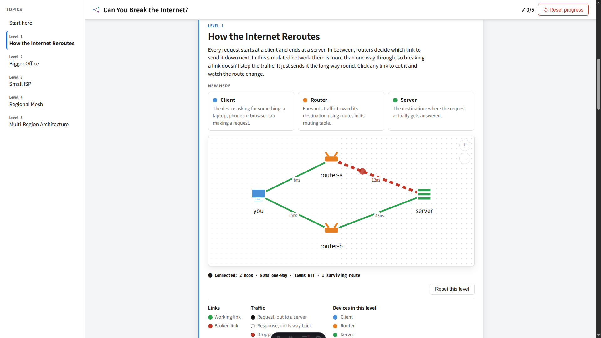
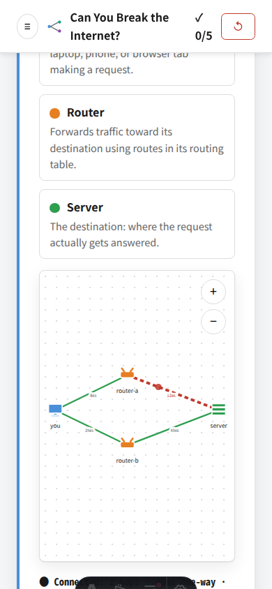

# Process overview
## What I built

A network-routing prototype: five levels move from a small client/router/server network to increasingly global infrastructure, and the player cuts links to see whether traffic can still find a route. The single mechanic carries the explanation: as links fail, hop count, latency, redundancy and eventual failure become visible rather than being explained only in prose.

## The moments that mattered

### One-way-edge routing bug - [4aa5fed](https://github.com/comp4020-agentic-coding-studio/comp4020-ass1-marcuszorian/commit/4aa5fed2b722cd9e1d1f3a11f374c720ae617b0f)

`routes()` originally walked an edge only from the `from` node to the `to` node, so the order in which a link was authored in `levels.ts` silently determined whether traffic could cross it. On the meshed levels this created dead ends that the diagram did not show: a physical path could exist in both directions while the routing walk could only traverse one. Rather than patching individual levels or rewriting their edge data, I changed the routing walk so a link is treated as a physical cable and is traversable in either direction. That matched the topology represented by the diagram and avoided encoding a false one-way property in the data.

### Independent return trip - [5fa12bf](https://github.com/comp4020-agentic-coding-studio/comp4020-ass1-marcuszorian/commit/5fa12bf5316dab1c7bb10d25482a54fb87a6ed4a)

The response animation originally replayed the request path in reverse. That was convenient, but it encoded an assumption of symmetric routing that the simulation did not need and real routing does not guarantee. Instead of swapping the path array, I added `roundTrip()` so the return leg is calculated independently as the lowest-cost route home from where the request actually landed. I verified the result against the diagrams rather than trusting the implementation: after breaking a suitable link, the return path could differ from the outbound path, which a reverse-replay implementation could never represent. At the same time I corrected explanatory copy that had presented simplified properties of routers, load balancers, CDNs and the internet as universal facts.

### Reroute vs. drop, and a bug the checks didn't catch - [0f305f0](https://github.com/comp4020-agentic-coding-studio/comp4020-ass1-marcuszorian/commit/0f305f045d292770e66c3e16f4d8aa1acfd43f75)

Reported bug: breaking a link mid-flight reset the packet to the client instead of rerouting it from where it was, and a link that was actually being crossed should drop the packet rather than let it survive. `diagram.ts` previously had no persisted notion of "where is the packet right now" — every toggle rebuilt the animation from scratch. I added `packetFlight.ts` to track a packet's phase, path and position across renders, and to decide per toggle whether the packet is unaffected, rerouted from its current position, or dropped, reusing the same `routes()` pathfinding from the independent-return-trip fix above rather than inventing new logic.

`pnpm check` passed cleanly against this — 62 tests green — but loading the real levels in the browser showed every one of them frozen on the first frame. The cause was a boundary case `phaseProgress()`'s unit tests never exercised: a `requestAnimationFrame` timestamp can land a few milliseconds before the `performance.now()` captured moments earlier, producing a negative elapsed time and an out-of-range array index. None of the hand-picked test fixtures happened to hit `now < phaseStart`. I found it by opening the running page rather than trusting the green suite, fixed it with a floor at zero, and it's the same lesson as the one-way-edge bug in `4aa5fed` showing up again in a different shape.

A dropped packet, frozen on the link it was crossing when that link broke, at both marking viewports:

